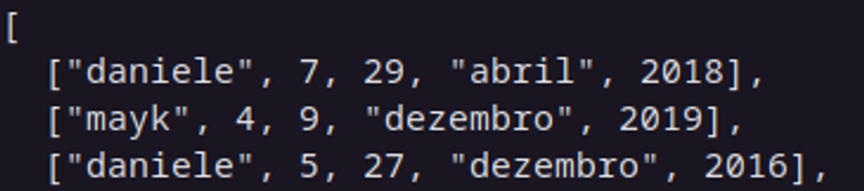

# Desafio 03 Ignite Elixir 

Esse é um desafio da trilha de Elixir do Ignite criado pela RocketSeat.

## 💻 Sobre o desafio
Nesse desafio, você deverá gerar um relatório a partir de um arquivo `.csv`.

Dez pessoas fizeram freelas para uma empresa X durante cinco anos e o histórico com todos os dados de cada uma dessas pessoas (nome, horas trabalhadas, dia, mês e ano) foram passadas para um arquivo CSV na seguinte ordem: nome, horas de trabalho no dia (que vai variar de 1 a 8 hrs), dia (que vai variar de 1 a 30 mesmo para o mês de fevereiro e sem considerar anos bissextos) referente às horas de trabalho, mês e ano (que vai de 2016 a 2020). Resumindo: **nome**, **quantidade de horas**, **dia**, **mês** e **ano**.
O relatório gerado a partir do arquivo (que está disponível para download logo abaixo) deve estar no seguinte formato:

```elixir
%{
  all_hours: %{
        danilo: 500,
        rafael: 854,
        ...
    },
  hours_per_month: %{
        danilo: %{
            janeiro: 40,
            fevereiro: 64,
            ...
        },
        rafael: %{
            janeiro: 52,
            fevereiro: 37,
            ...
        }
    },
  hours_per_year: %{
        danilo: %{
            2016: 276,
            2017: 412,
            ...
        },
        rafael: %{
            2016: 376,
            2017: 348,
            ...
        }
    }
}
```

Os caracteres ... é o espaço onde ficaria o resto dos dados. Esse é apenas um exemplo visual do que o retorno da função deve possuir, beleza?

## Testes

### test/parser_test.exs

Esse teste é referente ao arquivo `/test/parser_test.exs`

- **Parses the file**
    
    Para que esse teste passe, você deverá criar um módulo chamado **GenReport.Parser** com uma função chamada **parse_file**, e no escopo dela irá escrever o seu código para a correção do desafio.
    
    Este teste espera como resposta uma lista contendo cada item do csv dentro de uma lista com todos os dados dentro dele, já formatados para facilitar na hora de fazer o map.



### test/gen_report_test.exs

Esse teste é referente ao arquivo `/test/gen_report_test.exs`

- **When passing file name return a report**
    
    Para que esse teste passe, você deverá criar um módulo chamado **GenReport** com uma função chamada **build**, e no escopo dela irá escrever o seu código para a correção do desafio.
    
    Este teste espera como resposta um map com todos os dados dentro dele.
    
- **When no filename was given, returns an error**
Para que esse teste passo, você deverá criar uma função para tratar caso não seja passado um nome do arquivo como parâmetro da função.
